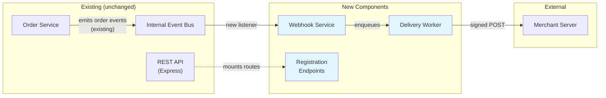
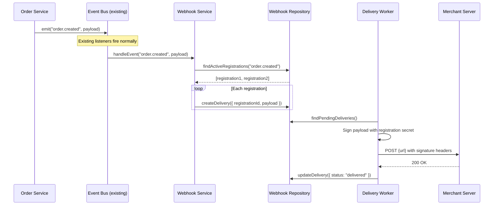
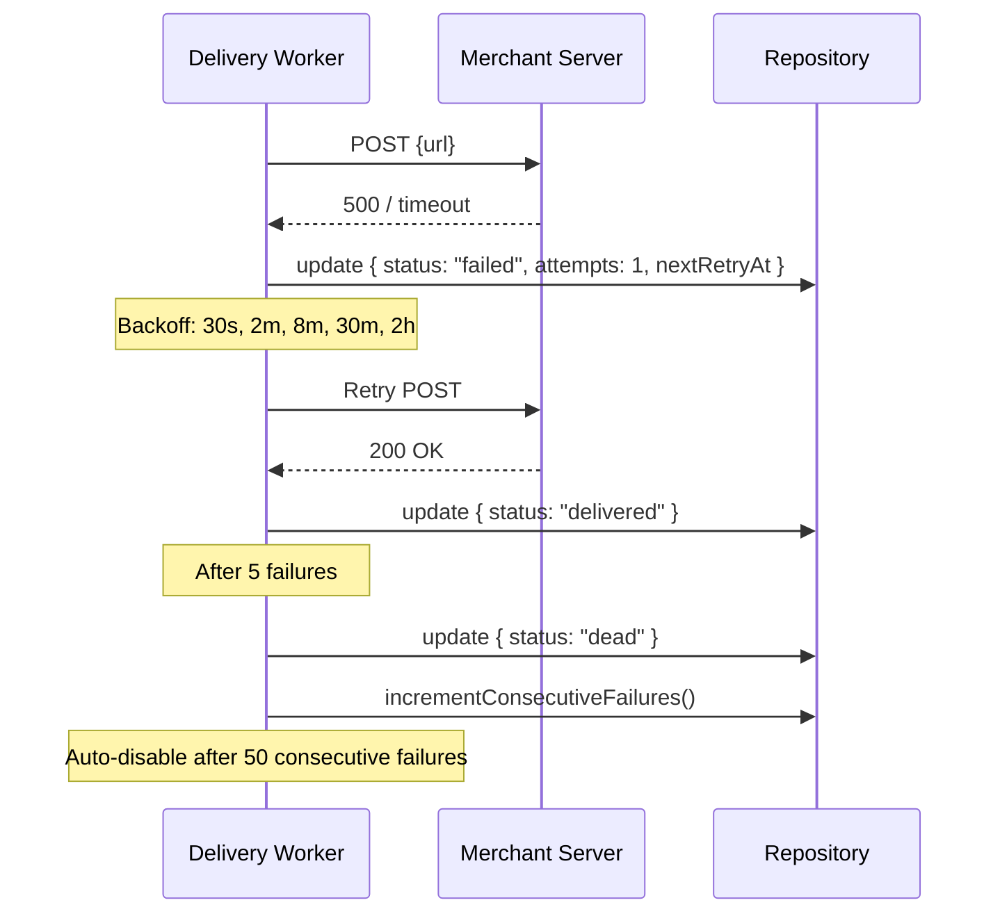

# Integration Design: Webhook Delivery for Order Events

> **Workflow**: Feature Integration | **Phase 4 Reviewed** ✓ | **Date**: 2025-02-05
> **Codebase**: `acme-api` (Node.js / Express / TypeScript / Prisma / PostgreSQL)

---

## Goal

Add outbound webhook support so merchant integrators receive real-time HTTP callbacks when order events occur (created, updated, fulfilled, cancelled). Must follow existing service/repository layered architecture, integrate with existing event system, and be feature-flagged. Success: merchant registers a URL via API, receives signed retryable POST within 5 seconds of an order event.

---

## Context Diagram



---

## Change Map

### Modified Files

| File | What Changes | Why |
|------|-------------|-----|
| `src/app.ts` | Mount webhook routes: `app.use('/api/v1/webhooks', webhookRouter)` | Expose registration API |
| `src/events/index.ts` | Register listener: `eventBus.on('order.*', webhookService.handleEvent)` | Connect to existing event bus |
| `prisma/schema.prisma` | Add `WebhookRegistration` and `WebhookDelivery` models | Persist registrations and delivery log |

### New Files

| File | Purpose | Follows Pattern Of |
|------|---------|-------------------|
| `src/services/webhook-service.ts` | Routing: match events to registrations, enqueue | `src/services/order-service.ts` |
| `src/services/webhook-delivery-worker.ts` | HTTP delivery with signatures, retry | `src/workers/email-worker.ts` |
| `src/routes/webhook-routes.ts` | Express CRUD for registrations | `src/routes/order-routes.ts` |
| `src/repositories/webhook-repository.ts` | Prisma queries | `src/repositories/order-repository.ts` |
| `src/utils/webhook-signer.ts` | HMAC-SHA256 signing | New — no existing equivalent |
| `src/types/webhook.ts` | Type definitions | `src/types/order.ts` |

### Database Changes

| Migration | Description | Reversible? |
|-----------|------------|-------------|
| `add_webhook_registrations` | New table | Yes — drop table |
| `add_webhook_deliveries` | New table | Yes — drop table |

### Configuration Changes

| Key | Type | Default | Purpose |
|-----|------|---------|---------|
| `WEBHOOKS_ENABLED` | boolean | `false` | Feature flag |
| `WEBHOOK_SIGNING_SECRET_SALT` | string | — | HMAC secret generation |
| `WEBHOOK_MAX_RETRIES` | number | `5` | Max delivery attempts |
| `WEBHOOK_TIMEOUT_MS` | number | `10000` | HTTP timeout per delivery |

---

## Data Flow

### Delivery (Happy Path)



### Delivery (Failure + Retry)



---

## New Component Details

### Webhook Service (`src/services/webhook-service.ts`)
- **Responsibility**: Matches events to registrations, enqueues deliveries.
- **Follows**: `src/services/order-service.ts` (constructor injection of repo).

```typescript
class WebhookService {
  constructor(private repo: WebhookRepository) {}

  async handleEvent(eventType: string, payload: Record<string, unknown>): Promise<void>;
  async registerWebhook(input: CreateWebhookInput): Promise<WebhookRegistration>;
  async listWebhooks(merchantId: string): Promise<WebhookRegistration[]>;
  async deleteWebhook(id: string, merchantId: string): Promise<void>;
  async rotateSecret(id: string, merchantId: string): Promise<{ secret: string }>;
}

type CreateWebhookInput = {
  merchantId: string;
  url: string;
  events: string[];
  description?: string;
};
```

### Webhook Signer (`src/utils/webhook-signer.ts`)
- **Responsibility**: Generates secrets and signs payloads.
- **No existing equivalent.**

```typescript
class WebhookSigner {
  generateSecret(): string;
  sign(payload: string, secret: string): string;  // HMAC-SHA256 hex
  buildHeaders(payload: string, secret: string): {
    "X-Webhook-Signature": string;
    "X-Webhook-Timestamp": string;
    "X-Webhook-Id": string;
  };
}
```

### Types (`src/types/webhook.ts`)

```typescript
type WebhookRegistration = {
  id: string;
  merchantId: string;
  url: string;
  events: string[];
  signingSecret: string;
  isActive: boolean;
  consecutiveFailures: number;
  createdAt: Date;
  updatedAt: Date;
};

type WebhookDelivery = {
  id: string;
  registrationId: string;
  eventType: string;
  payload: Record<string, unknown>;
  status: "pending" | "delivered" | "failed" | "dead";
  attempts: number;
  nextRetryAt: Date | null;
  lastResponseStatus: number | null;
  lastError: string | null;
  createdAt: Date;
};
```

---

## Modified Component Details

### Event Bus (`src/events/index.ts`)
- **Current**: Emits domain events to internal listeners (email, analytics).
- **After**: Unchanged — adding one new listener for `order.*` events.
- **Backward compatible**: Yes, purely additive.

---

## Implementation Phases

| Phase | Name | Delivers | Depends On | Size | Done When | Rollback |
|-------|------|----------|------------|------|-----------|----------|
| 1 | Schema + Repo | Prisma models, migration, repository CRUD | — | S | Migration runs, repo tests pass | Drop tables |
| 2 | Registration API | CRUD endpoints | Phase 1 | S | Create/list/delete via API | Remove routes |
| 3 | Signing + Worker | Signer, HTTP delivery, retry | Phase 1 | M | Delivers to mock with valid signature, retries | Stop worker |
| 4 | Event Wiring | Bus → service → worker | 1-3 | S | Order event → delivery in DB. Feature-flagged. | Disable flag |
| 5 | Hardening | Auto-disable, logging, monitoring | Phase 4 | S | Failures disable registration, metrics live | — |

```mermaid
gantt
    title Implementation Phases
    dateFormat X
    axisFormat %s
    section Foundation
    Schema + Repository       :p1, 0, 2
    section API
    Registration API          :p2, after p1, 2
    section Delivery
    Signing + Worker          :p3, after p1, 3
    section Integration
    Event Wiring              :p4, after p3, 1
    section Hardening
    Hardening                 :p5, after p4, 2
```



---

## Test Plan

**Existing tests to update**: None — purely additive. Verify existing event bus tests still pass.

**New tests**:
- `webhook-service.test.ts`: event matching, validation, duplicate prevention
- `webhook-signer.test.ts`: signature generation/verification, timestamp
- `webhook-delivery-worker.test.ts`: retry scheduling, backoff, dead-letter
- `webhook-flow.test.ts` (integration): register → emit → assert delivery + signature

**Regression**: Full CI suite. Specifically verify existing event listeners still fire.

---

## Open Questions

| # | Question | Why Deferred | Resolve By | Working Assumption |
|---|----------|-------------|------------|-------------------|
| 1 | Filter by order properties? (> $100) | No merchant request | Post-MVP | Event-type filtering only |
| 2 | IP allowlisting? | Security team input | Phase 5 | Signatures sufficient |
| 3 | Payload versioning? | One shape today | When payloads change | Unversioned |
