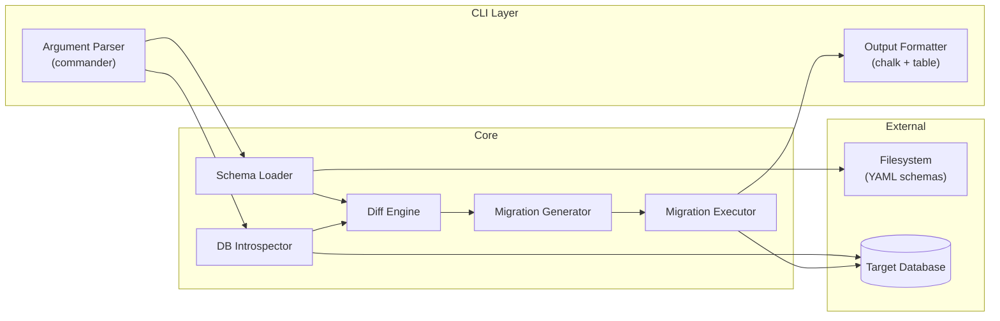

# Technical Design: Schema Migration CLI

> **Workflow**: Greenfield Design | **Phase 4 Reviewed** ✓ | **Date**: 2025-02-05

<!-- Abbreviated example showing how the design format adapts to a CLI tool (non-API, non-event-driven). Note the differences: no HTTP endpoints, no message brokers, different component vocabulary. -->

---

## Goal

Build a CLI tool that reads database schema definitions from YAML files, diffs them against the current database state, generates migration SQL, and applies it with dry-run and rollback support. Success: `schema-migrate diff` shows pending changes, `schema-migrate apply` runs them transactionally, `schema-migrate rollback` reverts the last batch.

---

## Architecture Overview



---

## Component Details

*(Showing two to calibrate CLI-appropriate vocabulary.)*

### Diff Engine
- **Responsibility**: Compares desired schema (from YAML) against actual schema (from introspection), produces a list of typed change operations.
- **Technology**: Pure TypeScript, no dependencies.

```typescript
type SchemaChange =
  | { kind: "create_table"; table: TableDef }
  | { kind: "drop_table"; tableName: string }
  | { kind: "add_column"; tableName: string; column: ColumnDef }
  | { kind: "alter_column"; tableName: string; from: ColumnDef; to: ColumnDef }
  | { kind: "create_index"; index: IndexDef }
  | { kind: "drop_index"; indexName: string; tableName: string };

interface DiffEngine {
  diff(desired: Schema, actual: Schema): SchemaChange[];
}
```

### Migration Executor
- **Responsibility**: Applies migration SQL within a transaction, records batch in migration history table, supports dry-run mode.
- **Technology**: pg (node-postgres), transactions.

```typescript
interface MigrationExecutor {
  apply(sql: string[], options: { dryRun: boolean }): Promise<ApplyResult>;
  rollback(batchId: string): Promise<RollbackResult>;
}

type ApplyResult =
  | { status: "applied"; batchId: string; statementsRun: number }
  | { status: "dry_run"; sql: string[] }
  | { status: "failed"; error: string; rolledBack: boolean };
```

---

## Walking Skeleton

**Use case**: `schema-migrate diff` on a single-table YAML → shows "create table" change.

**Real**: YAML parsing, DB introspection (empty DB), diff engine, SQL generation, terminal output.
**Stubbed**: Multi-table relationships, alter column, rollback, migration history.
**Proves**: Full pipeline from YAML → introspect → diff → SQL.
**Test**: Write a one-table YAML, run against empty DB, assert output contains `CREATE TABLE` with correct columns.

---

## Implementation Phases

| Phase | Name | Delivers | Depends On | Size | Done When |
|-------|------|----------|------------|------|-----------|
| 1 | Walking Skeleton | Loader, introspector, diff, SQL gen for CREATE TABLE | PostgreSQL | M | `diff` command shows correct CREATE TABLE |
| 2 | Full DDL | ALTER, DROP, indexes, constraints | Phase 1 | M | Diff detects all change types |
| 3 | Apply & Rollback | Transaction execution, batch tracking, rollback | Phase 2 | M | Apply + rollback round-trips cleanly |
| 4 | CLI Polish | Help text, colored output, dry-run, config file | Phase 3 | S | `--help` documents all commands |
