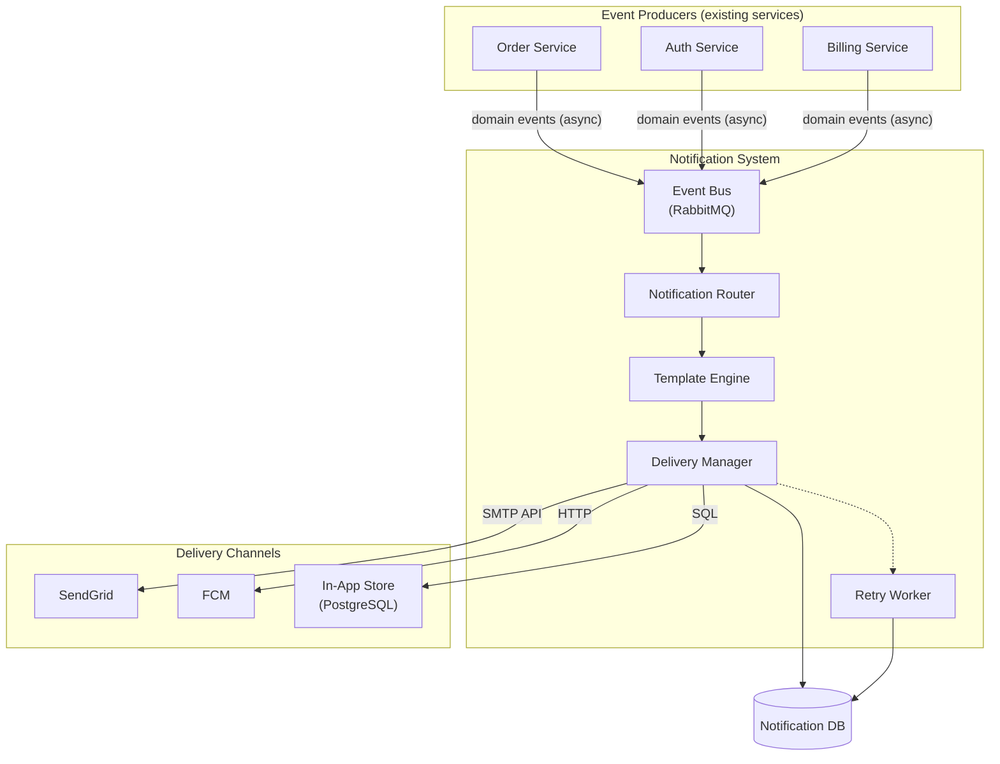
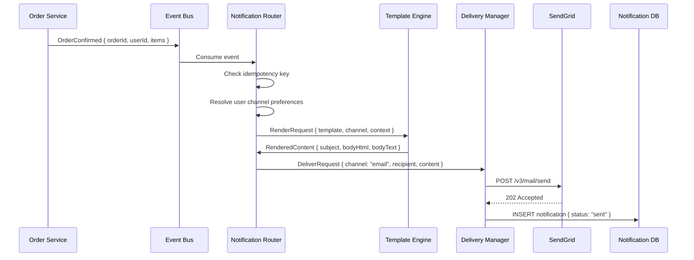
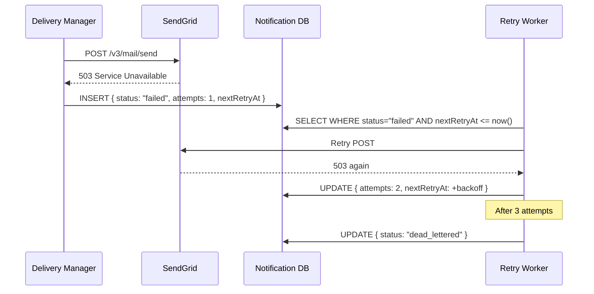

# Technical Design: Event-Driven Notification System

> **Workflow**: Greenfield Design | **Phase 4 Reviewed** ✓ | **Date**: 2025-02-05

---

## Goal

Design a notification system that decouples event producers from delivery channels, enabling any service on the platform to emit a domain event and have the notification system handle routing, templating, delivery, and retry across email, push, and in-app channels. Success: zero coupling between producers and channels, sub-second delivery for high-priority notifications, at-least-once delivery semantics.

---

## Architecture Overview



---

## Data Flow

### Happy Path: Order Confirmation



### Error Path: Delivery Failure with Retry



---

## Data Model

```typescript
type Notification = {
  id: string;                    // UUID
  userId: string;
  eventType: string;             // "order_confirmed", "password_reset"
  channel: "email" | "push" | "in_app";
  status: "pending" | "sent" | "failed" | "dead_lettered";
  idempotencyKey: string;        // UNIQUE — eventType + userId + eventId
  attempts: number;
  nextRetryAt: Date | null;
  lastAttemptAt: Date | null;
  externalId: string | null;     // SendGrid/FCM message ID
  createdAt: Date;
};

type NotificationEvent = {
  eventType: string;
  userId: string;
  payload: Record<string, unknown>;
  occurredAt: string;            // ISO 8601
  idempotencyKey: string;
};
```

---

## Directory Structure

```
notification-service/
├── src/
│   ├── index.ts                            # Entry point, DI setup
│   ├── config.ts                           # Typed env var config
│   ├── router/
│   │   ├── notification-router.ts          # Event → channel routing
│   │   ├── routing-rules.ts                # Per-event-type rules
│   │   └── user-preference-resolver.ts     # User channel preferences
│   ├── templates/
│   │   ├── template-engine.ts              # Handlebars rendering
│   │   ├── template-registry.ts            # Load/cache at startup
│   │   └── content/                        # .hbs files per event+channel
│   ├── delivery/
│   │   ├── delivery-manager.ts             # Send + record outcome
│   │   ├── retry-worker.ts                 # Poll + retry + dead-letter
│   │   ├── channels/
│   │   │   ├── channel.ts                  # DeliveryChannel interface
│   │   │   ├── email-channel.ts            # SendGrid
│   │   │   ├── push-channel.ts             # FCM
│   │   │   └── in-app-channel.ts           # DB write
│   │   └── retry-policy.ts                 # Backoff config
│   ├── events/
│   │   ├── event-consumer.ts               # RabbitMQ consumer
│   │   └── event-schemas.ts                # Zod validation
│   └── store/
│       ├── notification-repository.ts
│       └── migrations/
│           └── 001-create-notifications.sql
├── tests/
│   ├── unit/
│   └── integration/
├── package.json
├── tsconfig.json
└── Dockerfile
```

---

## Component Details

### Notification Router
- **Responsibility**: Consumes events, resolves routing rules and user preferences, orchestrates render → deliver.
- **Technology**: TypeScript, amqplib.

```typescript
interface NotificationRouter {
  handle(event: NotificationEvent): Promise<void>;
}

type RoutingRule = {
  eventType: string;
  channels: ("email" | "push" | "in_app")[];
  templateId: string;
  priority: "high" | "normal" | "low";
};
```

### Template Engine
- **Responsibility**: Renders notification content for a channel using Handlebars templates.
- **Technology**: Handlebars. Templates loaded from disk at startup.

```typescript
interface TemplateEngine {
  render(request: RenderRequest): Promise<RenderedContent>;
}

type RenderRequest = {
  templateId: string;
  channel: "email" | "push" | "in_app";
  context: Record<string, unknown>;
  locale?: string;
};

type RenderedContent = {
  subject?: string;     // email
  bodyHtml?: string;    // email
  bodyText: string;     // all
  title?: string;       // push
};
```

### Delivery Manager
- **Responsibility**: Sends rendered notifications, records outcomes, schedules retries.
- **Technology**: @sendgrid/mail, firebase-admin.

```typescript
interface DeliveryChannel {
  readonly channelType: "email" | "push" | "in_app";
  send(request: DeliveryRequest): Promise<DeliveryResult>;
  healthCheck(): Promise<boolean>;
}

type DeliveryRequest = {
  recipient: { email?: string; deviceToken?: string; userId: string };
  content: RenderedContent;
  metadata: { eventType: string; idempotencyKey: string };
};

type DeliveryResult =
  | { status: "delivered"; externalId: string }
  | { status: "failed"; error: string; retryable: boolean }
  | { status: "rate_limited"; retryAfterMs: number };
```

### Retry Worker
- **Responsibility**: Polls for failed notifications, retries with backoff, dead-letters after max attempts.
- **Technology**: Polling loop (setInterval).

```typescript
type RetryPolicy = {
  maxAttempts: number;       // 3
  baseDelayMs: number;       // 5000
  backoffMultiplier: number; // 2
};
```

---

## Cross-Cutting Concerns

**Error handling**: Channel failures typed via `DeliveryResult`. Non-retryable failures (invalid address) skip retry. All errors logged with structured context.

**Observability**: JSON structured logging. Metrics: `notifications.sent`, `notifications.failed` (by channel), `delivery.latency_ms`. Health endpoint at `/health`.

**Configuration**: Env vars, typed through `config.ts`, validated at startup.

---

## Walking Skeleton

**Use case**: OrderService emits `OrderConfirmed` → Router consumes → Template Engine renders email → Email Channel sends via SendGrid → DB records delivery.

**Real**: Event consumption, routing, rendering, SendGrid delivery, DB persistence.
**Stubbed**: User preferences (hardcoded email-only), retry worker (not running), push/in-app channels.
**Proves**: Full async pipeline from event to delivered email.
**Test**: Publish `OrderConfirmed` → assert DB has `status: "sent"` → assert SendGrid sandbox received the call.

---

## Implementation Phases

| Phase | Name | Delivers | Depends On | Size | Done When |
|-------|------|----------|------------|------|-----------|
| 1 | Walking Skeleton | Consumer, router, templates, email channel, DB store | RabbitMQ + PostgreSQL | M | Event → email → DB record |
| 2 | Push & In-App | FCM + in-app delivery | Phase 1 | S | Each channel passes integration test |
| 3 | User Preferences | Preference resolver, router respects them | Phase 1 | S | Push-only user gets push, not email |
| 4 | Retry & Dead Letter | Retry worker, backoff, DLQ | Phase 1 | M | Failed → 3 retries → dead-lettered |
| 5 | Observability | Metrics, logs, health checks, graceful shutdown | 1-4 | S | Dashboard shows rates/latency/failures |

```mermaid
gantt
    title Implementation Phases
    dateFormat X
    axisFormat %s
    section Foundation
    Walking Skeleton          :p1, 0, 3
    section Channels
    Push & In-App             :p2, after p1, 2
    section Features
    User Preferences          :p3, after p1, 2
    Retry & Dead Letter       :p4, after p1, 3
    section Hardening
    Observability             :p5, after p4, 2
```



---

## Open Questions

| # | Question | Why Deferred | Resolve By | Working Assumption |
|---|----------|-------------|------------|-------------------|
| 1 | Per-event-type or global channel preferences? | Needs product input | Phase 3 | Global per channel |
| 2 | Push rate limiting? | Need production data | Phase 5 | No limit initially |
| 3 | Multi-language templates? | No i18n requirement | Post-MVP | English only |
